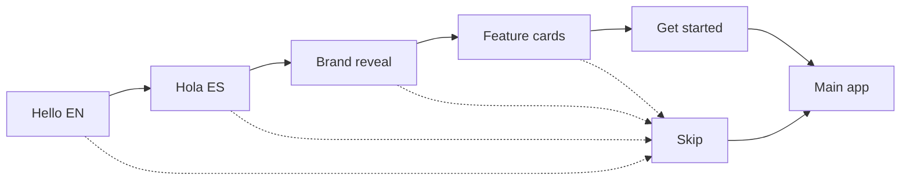
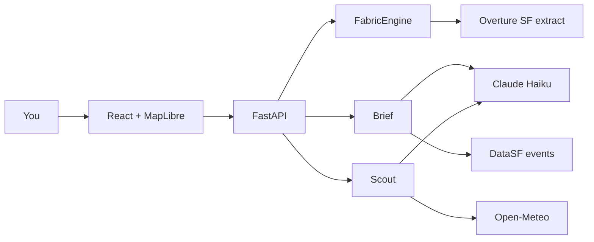
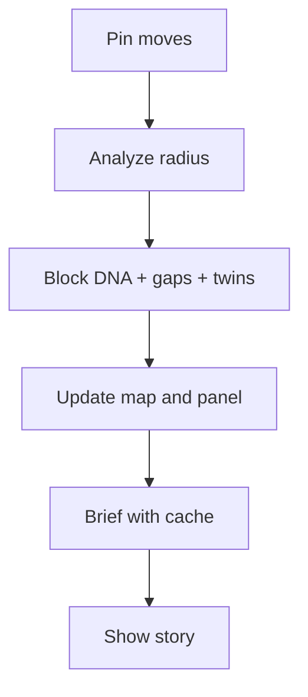
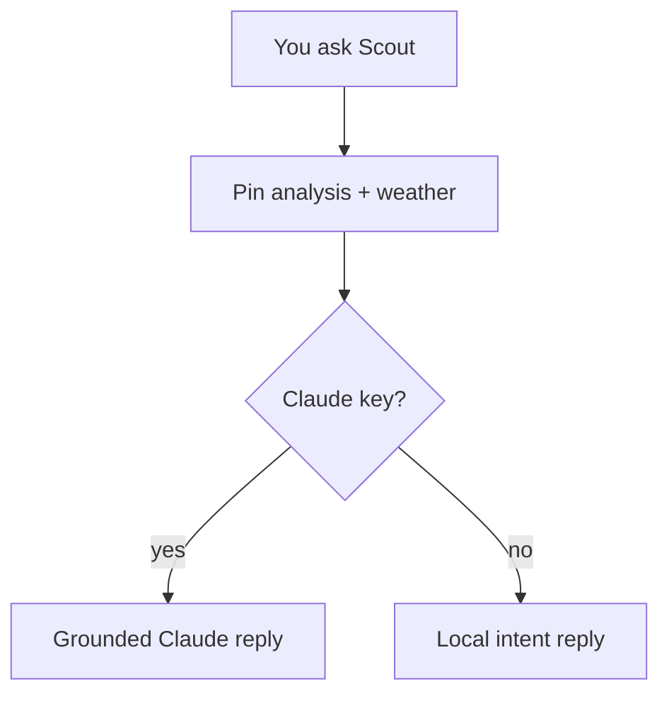

# Placeprint - write-up

Drop a pin on any San Francisco block and read its placeprint - block DNA, a short story, twin blocks nearby, and Scout (a chat guide grounded in that pin’s data + live weather).

Short setup: [README.md](./README.md)

---

Most map apps answer “what’s nearby?” Placeprint answers **“what is this block like?”** - the mix of cafes, clinics, parks, shops - then compares that mix to similar SF pockets so gaps feel relative, not absolute.

---

## Claude API (recommended)

For the best use, **set** `ANTHROPIC_API_KEY` so:

- the neighborhood brief gets a natural Claude polish, and  
- Scout answers like a real local guide (still grounded only on pin facts + weather).

I can share a key for review, or you can add your own in the host `.env` . Without a key, core map / DNA / twins still work fully.

---

## How to try it

1. Intro (or Skip) → **Explore San Francisco** or **Use my location** (SF only).
2. Drag the pin or change walk radius → read the brief.
3. Tap **Block DNA** to filter the map; hover/click places for name and address.
4. Jump twin pins **1-5**.
5. Open **Scout** - ask about weather, cafes, or what’s thin here.
6. Toggle **EN ↔ ES** (place names stay as in the data).

---

## Diagrams

### Experience flow

### System architecture

### Pin → story

### Scout

---

## What’s in the product

| Area              | What you get                                                                              |
| ----------------- | ----------------------------------------------------------------------------------------- |
| **Map**           | Draggable pin, walk radius, Explore SF, location (SF-gated), twin pins 1–5, category dots |
| **Block DNA**     | Category mix radar; tap to filter the map                                                 |
| **Brief**         | Short story from facts; Claude polish when keyed; ~12 min cache                           |
| **Scout**         | Pin-grounded chat + live weather; suggestion chips                                        |
| **Language**      | EN ↔ ES for UI and categories                                                             |
| **Observability** | `GET /api/metrics`, product events, no chat text stored                                   |

**Weather:** When you ask Scout about the weather, the API calls **[Open-Meteo](https://open-meteo.com/)** (free, no API key) with the **current pin’s lat/lon**, gets live conditions (temp, feels-like, wind, humidity), and passes that into Scout’s context. Scout must not invent weather if the fetch fails. Results are cached ~10 minutes per rounded coordinate.

**Observability APIs (light, no Datadog):**

- `GET /api/metrics` - open this in a browser while the backend is running. Returns uptime, place count, counters (e.g. `analyze.ok`, `summary.claude`, `event.explore_sf`), and timing stats (p50 / p95 / last ms) for analyze, summary, chat, and places. Coordinates in logs are rounded; **chat text is never stored**.
- `POST /api/events` - the frontend posts short product beacons here (explore SF, use location, category tap, Scout open, twin jump, intro done/skip, …). Browsers can’t “view” this URL (GET returns Method Not Allowed). Example check:  
`curl -X POST http://127.0.0.1:8000/api/events -H 'Content-Type: application/json' -d '{"name":"explore_sf","props":{}}'` → `{"ok":true}`, then refresh `/api/metrics` to see the counter.

**Data:** Overture places (SF file) · OpenFreeMap basemap · DataSF Rec/Our415 activities · Wikipedia landmarks · Open-Meteo weather · Claude Haiku (optional but recommended).

---

## Constraints

1. **SF only** - demo bounds; outside SF is blocked clearly.
2. **Overture is a file extract** - analysis is live on that file, not a live planet feed.
3. **Crow-flies walks** - hills and one-ways ignored.
4. **Claude polishes facts** - it does not invent the map; no key = local fallbacks.
5. **Events are Rec / Our415** - not Ticketmaster nightlife; cached briefs can lag events up to ~12 min.
6. **Scout stays on this pin** - not a general open-web SF chatbot.

---

## Edge cases

1. **Outside SF** - modal; pin stays in SF until you Explore.
2. **Sparse pin** (water / empty park) - thin DNA; gaps and twins can look odd.
3. **Location denied** - error message; Explore SF still works.
4. **No Claude key / API down** - local brief and local Scout; map still works.
5. **Fast pin dragging** - debounce + cache avoid extra Claude calls.
6. **Missing places file** - API won’t start until `download_places.py` has been run.

---

## Trade-offs

| Chose                             | Instead of                          |
| --------------------------------- | ----------------------------------- |
| Story + DNA + twins on one pin    | Multi-city product                  |
| Gaps vs similar SF cells          | Raw city-wide average               |
| Fact-first brief + grounded Scout | Open-web LLM that can invent places |
| DataSF activities (free, live)    | Commercial nightlife ticket feeds   |
| Debounce + TTL cache              | Claude on every pin nudge           |
| One FastAPI monolith              | Microservices                       |

---

## Future work

1. **Scale beyond one box** - multi-city with tiled / GeoParquet Overture serve; don’t load a whole city into one process.
2. **From monolith to microservices** - split map-analyze, brief/Scout, and data ingest into separate services; deploy on **Kubernetes** with autoscaling, health checks, and rolling updates as traffic grows.
3. **Traffic and load** - queue or rate-limit Claude; shared Redis cache for briefs; horizontal API replicas; keep `/api/metrics` (or Datadog) for latency and error rates.
4. **Richer live events** - nightlife / Ticketmaster-class feeds next to Rec/Our415, with clear source labels and fresher TTLs.
5. **True walk / drive time** - replace crow-flies radius with network travel:
  - Run a routing engine (**OSRM** or **Valhalla**) on SF road data (OSM or Overture transportation).
  - Backend: isochrone / “reachable within N minutes” polygons for **walk** and **drive** modes; keep the same analyze + DNA + twins pipeline on places inside that polygon.
  - UI: mode toggle (Walk / Drive) next to the existing 5 / 10 / 15 min controls; draw the isochrone instead of (or over) the circle.
  - Out of scope without a router: drive ETAs from Overture places alone.

---

## Attribution

Places © [Overture Maps Foundation](https://overturemaps.org/) · Basemap [OpenFreeMap](https://openfreemap.org/) © [OpenMapTiles](https://openmaptiles.org/) · © [OpenStreetMap](https://www.openstreetmap.org/copyright)  
Events: [DataSF](https://data.sfgov.org/) · Landmarks: Wikipedia · Weather: [Open-Meteo](https://open-meteo.com/)